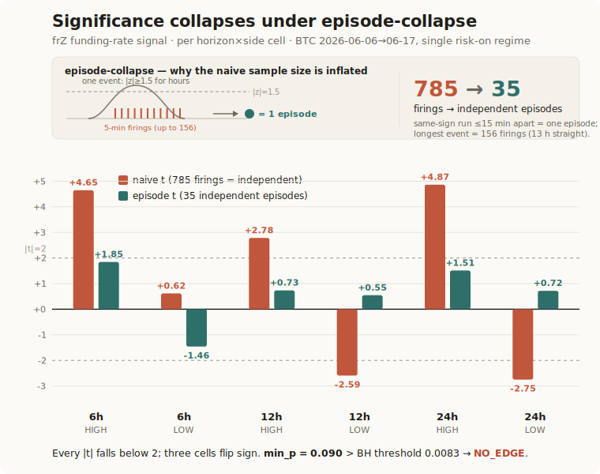
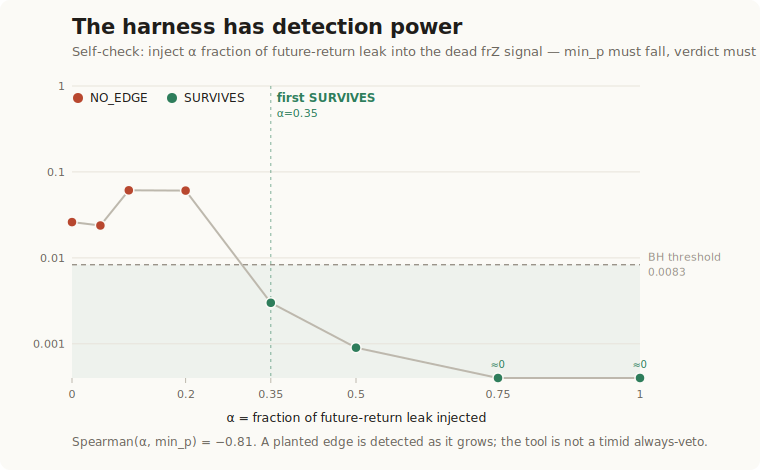

# touchstone

A falsification harness for trading signals — **strategy evaluation & benchmarking**.

Touchstone takes any scalar signal aligned to a price series and tries to **kill** the
claim that it has an edge. It emits a machine-readable verdict — `SURVIVES` or
`NO_EDGE` — after a five-stage pipeline that most backtests skip. It does the same to a
gate/filter's block decisions (the *Gate Selectivity Test*): `SELECTIVE` or
`NOT_SELECTIVE`.

It is honest by construction: both axes are **orthogonal to PnL**, and the tool says so
in every output. A passing verdict is *necessary, not sufficient* for a profitable
system.

> Subject #1 is the author's own funding-rate strategy (`examples/perceptrade-frz/`),
> which touchstone reports as `NO_EDGE`. The first thing it kills is its maker's.

---

## 30-second quickstart

No dependencies. Node 18+. Nothing to configure; the bundled examples run out of the box.

```bash
git clone https://github.com/cryptohakka/touchstone
cd touchstone

# the falsification case — the author's own funding-rate signal → NO_EDGE
node src/index.mjs examples/perceptrade-frz/input.json --map price=btcPrice signal=frZ

# the positive control — a synthetic signal with a planted edge → SURVIVES
node src/index.mjs examples/synthetic-leak/input.json
```

The first command runs touchstone on its own subject #1 and reports `NO_EDGE` — the
falsification case the whole tool is built around. The second is a *synthetic signal with a
planted edge*; it returns `SURVIVES`, proving the harness is not a timid always-veto but
detects real edge when it's there. perceptrade-frz = the falsification case; synthetic =
proof of operation. See "Self-validation" and "Subject #1" below.

You'll get a human summary on stderr and a verdict JSON on stdout. `node --test` runs a
deterministic, seeded test suite. `node src/index.mjs --help` is a complete reference.

## What it answers

| axis | question | verdict | needs |
|------|----------|---------|-------|
| signal alpha | does this signal have edge that survives correction? | `NO_EDGE` / `SURVIVES` | price+signal series |
| gate selectivity | does this filter block worse-than-random trades, or just randomly? | `NOT_SELECTIVE` / `SELECTIVE` | + a block decision log |

Both are orthogonal to realized PnL.

## Input format

A JSON array. Each record needs a timestamp, a price, and one scalar signal:

```json
[{ "timestamp": "2026-06-06T00:00:00.000Z", "btcPrice": 65960.71, "frZ": -1.591 },
 { "timestamp": "2026-06-06T00:05:00.000Z", "btcPrice": 65913.48, "frZ": -1.462 },
 { "timestamp": "2026-06-06T00:10:00.000Z", "btcPrice": 65871.80, "frZ": -1.374 }]
```

- **timestamp** — anything `Date.parse` accepts (ISO 8601 recommended).
- **price** — the underlying instrument's price (number).
- **signal** — one scalar per snapshot (number). A z-score, a deviation, a confidence,
  anything 1-dimensional.

If your field names are exactly `timestamp` / `price` / `signal`, no `--map` is needed.
Otherwise map them: the example above uses `btcPrice` / `frZ`, so it needs
`--map price=btcPrice signal=frZ`. Dotted paths work: `signal=directionSignal.frZ`.

## Apply it to your own signal

If your bot or backtest already logs a price and a decision score each step, you're done
in one step: dump those to a JSON array and map the field names.

```bash
# centered z-like signal (funding-z, MACD histogram, VWAP deviation):
node src/index.mjs mydata.json --map price=close signal=zscore

# non-centered signal (RSI 0..100, a 0..1 confidence score): standardize it first
node src/index.mjs mydata.json --map price=close signal=rsi14 --standardize
```

`--standardize` z-scores the signal to mean 0 / sd 1 so the default `--threshold 1.5`
means "1.5 SD" regardless of the signal's native scale.

**Have a CSV?** Convert it to the JSON array touchstone reads with a one-liner (no deps):

```bash
node -e 'const fs=require("fs"),[h,...r]=fs.readFileSync("mydata.csv","utf8").trim().split(/\r?\n/);const k=h.split(",");console.log(JSON.stringify(r.map(l=>Object.fromEntries(l.split(",").map((v,i)=>[k[i],isNaN(+v)?v:+v])))))' > mydata.json
```

Then map your column names as usual: `--map time=time price=close signal=rsi`.

## Reading the output

```jsonc
{
  "headline": "signal: NO_EDGE | gate: NOT_SELECTIVE",
  "signal_alpha": {
    "verdict": "NO_EDGE",            // no cell survived multiple-comparison correction
    "n_episodes": 35,                 // autocorrelated firings collapsed to 35 independent episodes
    "multiple_comparison": {
      "method": "BH", "M": 6,         // 6 cells tested (3 horizons x 2 sides), all >= min_episodes
      "min_episodes": 5,              // cells with fewer independent episodes are excluded
      "bh_rejected": [],              // survivors after Benjamini-Hochberg
      "min_p": 0.0897,                // best raw p-value; > BH threshold 0.00833 -> dies
      "underpowered_excluded": []     // [{ label, nEpisodes }] for any cell dropped by the guard
    },
    "power": [{ "n_episodes": 13, "min_detectable_d": 0.97 }],  // NO_EDGE is bounded by this
    "note": "No detectable edge != no edge exists."
  },
  "gate_selectivity": {
    "verdict": "NOT_SELECTIVE",
    "firing_pool": { "gate_mean": -0.3074, "random_mean": -0.2477, "percentile": 13.8 },
    "note": "Gate selectivity is orthogonal to PnL."
  },
  "disclaimer": "Both axes are orthogonal to realized PnL."
}
```

Read it as: `NO_EDGE` = this signal's apparent edge does not survive correction;
`SURVIVES` = at least one horizon×side cell beats Benjamini-Hochberg. `min_p` above the
BH threshold is the usual cause of death — a result that looks significant alone
(`min_p=0.0897`) but fails once you account for testing 6 cells. `power` bounds the
honesty of a `NO_EDGE`: at this episode count the smallest reliably-detectable effect is
`d≈0.97`, so *no edge detected ≠ no edge exists*.

## The five stages (signal-alpha axis)

1. **Forward return** at each firing, over each horizon.
2. **Beta-adjust** — subtract the horizon's market drift, so gains that were just the
   underlying's beta don't count as signal.
3. **Episode-collapse** — merge consecutive same-sign firings into independent episodes.
   This is where t-stats inflated by autocorrelation die: on the subject signal the
   strongest cell's naive |t|≈4.9 collapses to episode |t|<2, and three of the six cells
   flip sign once each event is counted once instead of once per 5-minute firing.
4. **Multiple comparison** (Benjamini-Hochberg + Bonferroni) across all horizon×side cells
   that survive a minimum-episode guard: cells left with fewer than `--min-episodes` (default
   5) independent episodes are excluded from testing — a truncated horizon reduced to a
   couple of episodes can fire an explosive t-stat off near-zero variance, and the harness
   refuses to vote on its own degenerate cells. Excluded cells are still reported, under
   `underpowered_excluded`.
5. **Power** — report the minimum detectable effect at the episode-level n, so `NO_EDGE`
   is bounded rather than overclaimed.



*Naive vs episode t on the frZ subject. 785 autocorrelated firings collapse to 35 independent episodes; `min_p = 0.090` &gt; the BH threshold `0.0083` → `NO_EDGE`.*

## Self-validation

Touchstone validates itself on *your* data. `--selfcheck` runs three checks:

```bash
node src/index.mjs examples/perceptrade-frz/input.json --map price=btcPrice signal=frZ \
  --selfcheck --json selfcheck.json
```

- **detection power** — graded future-leak injection: as genuine signal is mixed in, the
  verdict must flip `NO_EDGE → SURVIVES` with `min_p` falling monotonically. On the frZ
  subject this happens at **α=0.35** (Spearman −0.81). The harness is not a timid
  always-veto; it detects real edge when it's there.
- **no false positive** — a time-shuffled copy of the signal must stay `NO_EDGE`. It does.
- **direction invariance** — sign-flipping the signal (z → −z) must leave `min_p`
  unchanged, since the verdict is two-sided. It does. This catches accidental directional
  bias in the harness.

The subject signal's own baseline is `NO_EDGE` with a raw `min_p` that looks tempting in
isolation but dies under correction — while the *harness* clearly detects a planted edge
at α=0.35. Read together: the tool finds edge when it exists; the subject just doesn't
have it.



*Detection-power curve. Injecting a graded future-return leak into the dead frZ signal drives `min_p` below the BH threshold at **α=0.35** (Spearman −0.81) — the harness detects real edge rather than always vetoing.*

## The Gate Selectivity Test

Given a log of trades a gate *blocked*, touchstone bootstraps random blocks from the same
firing population and asks whether the gate's blocked set is significantly worse-than-random.
Two guards are baked in:

- the gate's actual mean is **recomputed with the same PnL formula** as the baseline
  (never compared across different bases);
- the baseline side is derived from **each drawn point's own signal**, not the recorded
  block list.

`SELECTIVE` means the gate discriminates within the firing population. It does **not** mean
the system is profitable. A `SELECTIVE` gate on a `NO_EDGE` signal correctly does nothing —
and on subject #1 touchstone reports **both axes negative** (`NO_EDGE` + `NOT_SELECTIVE`),
which is internally consistent: selectivity and edge are orthogonal, and both negative means
the system has neither a signal to act on nor a gate that beats coin-flipping. No tool in the
overfitting-detection family below tests the gate layer — this axis is specific to touchstone.

The gate's PnL uses an execution model: default **leverage 2** and **round-trip fee 0.24%**
(0.06% maker+taker, two legs, at 2x). Override with `--leverage` and `--fee`; both the gate's
actual mean and the random baseline use the same values, so the verdict is fee-symmetric.

Decision-log format: any array of resolved records carrying a pnl field, an optional
`side`, and an entry timestamp (`entry_time` / `entryTime` / `opened_at` / … auto-detected):

```json
[{ "resolved": true, "side": "short", "entry_time": "...", "virtual_pnl_pct": -0.31 }]
```

If your log uses different keys, map them — no need to rewrite the file. Side values are
normalized (`long|l|buy|1` → long, `short|s|sell|-1` → short):

```bash
# log records look like { blocked:true, dir:'S', ts:'...', pnl_pct:-0.31 }
node src/index.mjs data.json --map price=close signal=rsi --standardize \
  --gate skips.json --gate-map resolved=blocked side=dir pnl=pnl_pct
```

## All flags

See `node src/index.mjs --help` for the canonical list with examples. Summary:
`--map`, `--standardize`, `--threshold`, `--horizons`, `--gap`, `--min-episodes`, `--sph`, `--gate`,
`--selfcheck`, `--leak-horizon`, `--seed`, `--diag`, `--json`.

## Machine-readable spec

For agents and LLMs integrating touchstone programmatically.

**Input series** — `Array<{ [timeField]: string|number, [priceField]: number, [signalField]: number }>`.
Default field names `timestamp`/`price`/`signal`; override with `--map k=field`. Records
with non-finite mapped values are dropped. Minimum 30 usable rows.

**Decision log** (`--gate`) — `Array<{ resolved: true, [pnlField]: number, side?: "long"|"short", <entryTimeField>: string|number }>`.
`pnlField` defaults to `virtual_pnl_pct`. Entry-time auto-detected from
`entry_time|entryTime|opened_at|openedAt|entry_ts|timestamp|time|ts`.

**Verdict output** (default mode) — object with:
`headline: string`, `signal_alpha: { verdict: "NO_EDGE"|"SURVIVES", n_snapshots, n_episodes, threshold, cadence_snapshots_per_hour, horizons_hours, multiple_comparison: { method, M, min_episodes, bh_rejected: string[], bonferroni_survivors: string[], min_p, min_p_cell, underpowered_excluded: [{ label, nEpisodes }] }, power: [{ n_episodes, min_detectable_d }], note }`,
`gate_selectivity: null | { verdict: "SELECTIVE"|"NOT_SELECTIVE", horizon_min, execution, n_blocks, basis_used: "recomputed"|"recorded", mapped_coverage, coverage_warning, firing_pool: { size, gate_mean, random_mean, percentile }, all_pool, note }`,
`disclaimer: string`.

**Self-check output** (`--selfcheck`) — object with:
`baseline_signal: { min_p, bh_survivors, verdict }`,
`detection_power: { leak_curve: [{ alpha, min_p, bh_survivors, verdict }], first_survive_alpha, spearman_alpha_minp, passes }`,
`null_shuffle: { verdict, passes }`, `null_sign_flip: { verdict, passes }`,
`summary: { detection_power, no_false_positive, direction_invariant, overall }`.

**Exit codes** — `0` success; `1` bad usage or unusable input. Human summary on stderr,
JSON on stdout (or to `--json <file>`). Reproducible: `node --test` runs a deterministic,
seeded suite (data seed 7, shuffle-null seed 12345) asserting noise → `NO_EDGE`, a planted
leak → `SURVIVES`, and that the synthetic self-check first flips at **α=0.2**. (The α=0.35
figure in Self-validation is the frZ *subject*, which is harder to revive than synthetic
noise — consistent with it carrying no edge of its own.)

## Related work

The overfitting-detection family — Probabilistic Sharpe Ratio, **Deflated Sharpe Ratio**,
Probability of Backtest Overfitting (Bailey & López de Prado; `pypbo`, AuditZK's PBO
calculator) — corrects selection bias **across many strategy trials / parameter
configurations**, operating on returns or Sharpe ratios.

Touchstone is complementary, not competing. It works **one level upstream**, on a single
signal's raw series, and corrects a different set of failure modes: intra-signal firing
**autocorrelation** (via episode-collapse), **multiple horizons/sides** within one signal,
market **beta** leakage, and — uniquely — **gate-layer selectivity**. It does not trust a
reported Sharpe; it recomputes forward returns from price. Use DSR/PBO to judge a search
over many strategies; use touchstone to judge one signal and its veto layer.

## Roadmap (v2)

- native asymmetric / bounded signals — currently handled via the `--standardize` workaround;
  native support would skip standardization and allow a custom one-sided `sideRule`
- continuous position-sizing signals (weighted episodes)
- optional DSR-style correction as an additional cell-level adjustment
- multi-regime conditioning (the current subject window is a single risk-on regime)

## License

MIT
